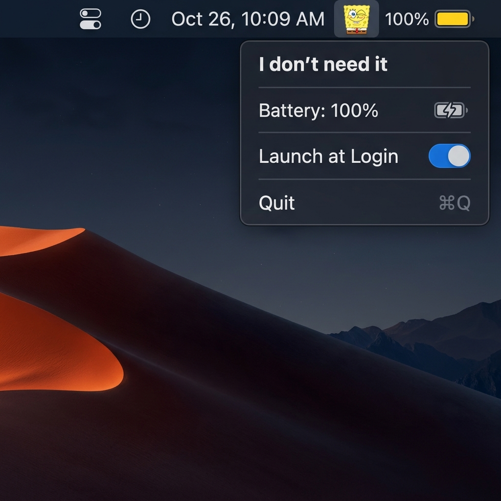
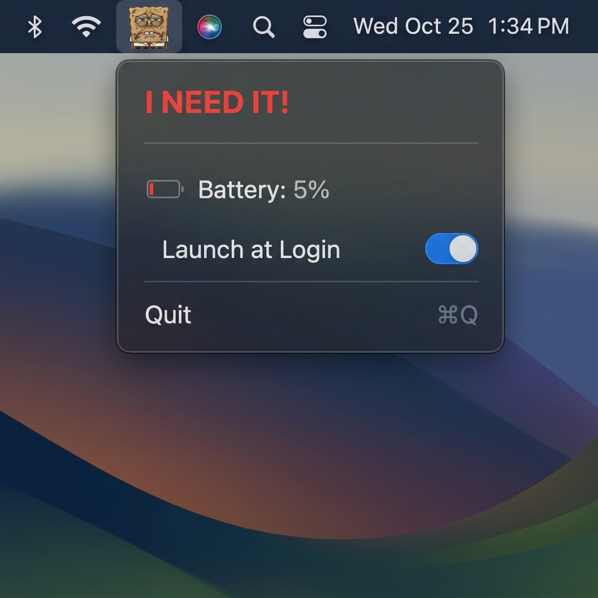

# 🧽 SpongeBob Battery for macOS

<div align="center">


A delightful, lightweight macOS Menu Bar application that displays **SpongeBob SquarePants drying out** in 10 stages as your MacBook battery percentage decreases!

<p align="center">
  
  &nbsp; &nbsp;
  
</p>

</div>

---

## ✨ Features

- **⚡ 10-Stage Dynamic Drying Icon:**
  - As your MacBook battery drains, SpongeBob dynamically shrivels and dries out across 10 distinct percentage stages (100% ➡️ 0%).
- **💬 Contextual Quotes:**
  - **Battery > 20%:** *"I don't need it"*
  - **Battery 11% - 20%:** *"I actually need it."*
  - **Battery ≤ 10%:** *"I NEED IT!"*
- **🚀 Zero CPU / Zero Polling (Event-Driven):**
  - Powered by macOS `IOKit` (`IOPSNotificationCreateRunLoopSource`). No background polling or timers; updates strictly when the OS broadcasts battery status changes.
- **✨ Pure Menu Bar Resident:**
  - Configured with `LSUIElement = true` so it lives strictly in your Menu Bar without cluttering the macOS Dock.
- **🔄 Launch at Login:**
  - Toggle automatic startup at boot via modern `ServiceManagement` (`SMAppService`).

---

## 📥 Download & Installation

### 1. Download Ready-to-Use App
Download the latest **`SpongeBobBattery-macOS.zip`** from the [GitHub Actions Artifacts](../../actions) or [Releases](../../releases) tab.

### 2. Install on macOS
1. Extract `SpongeBobBattery-macOS.zip` and move `SpongeBobBattery.app` to your `/Applications` folder.
2. Because the application is not signed with a paid Apple Developer certificate ($99/year), macOS Gatekeeper may show an *"unidentified developer"* notice upon first launch.

**To allow it (choose either):**
- **Option A (Terminal - 1 Second):**  
  Open Terminal and run:
  ```bash
  xattr -cr /Applications/SpongeBobBattery.app
  ```
- **Option B (System Settings):**  
  Go to **System Settings ➡️ Privacy & Security**, scroll down to **Security**, and click **"Open Anyway"**.

---

## 🛠️ Building from Source

### Requirements
- macOS 13.0 (Ventura) or later
- Xcode 15.0+ or Swift 5.9+ command-line tools

### Build via Command Line
```bash
# Clone the repository
git clone https://github.com/MrMdd/spongebob-battery-mac.git
cd spongebob-battery-mac

# Compile Asset Catalog
mkdir -p SpongeBobBattery.app/Contents/Resources
mkdir -p SpongeBobBattery.app/Contents/MacOS
actool Assets.xcassets --compile SpongeBobBattery.app/Contents/Resources --platform macosx --minimum-deployment-target 13.0

# Compile Swift Code (Universal Binary)
SDK_PATH=$(xcrun --show-sdk-path --sdk macosx)
swiftc -O -parse-as-library -target arm64-apple-macos13.0 -sdk "$SDK_PATH" \
       -framework SwiftUI -framework IOKit -framework ServiceManagement -framework AppKit \
       BatteryMonitor.swift SpongeBobBatteryApp.swift \
       -o SpongeBobBattery.app/Contents/MacOS/SpongeBobBattery

# Copy Info.plist & sign ad-hoc
cp Info.plist SpongeBobBattery.app/Contents/Info.plist
codesign --force --deep --sign - SpongeBobBattery.app
```

---

## 📄 License
This project is open source and available under the [MIT License](LICENSE).
